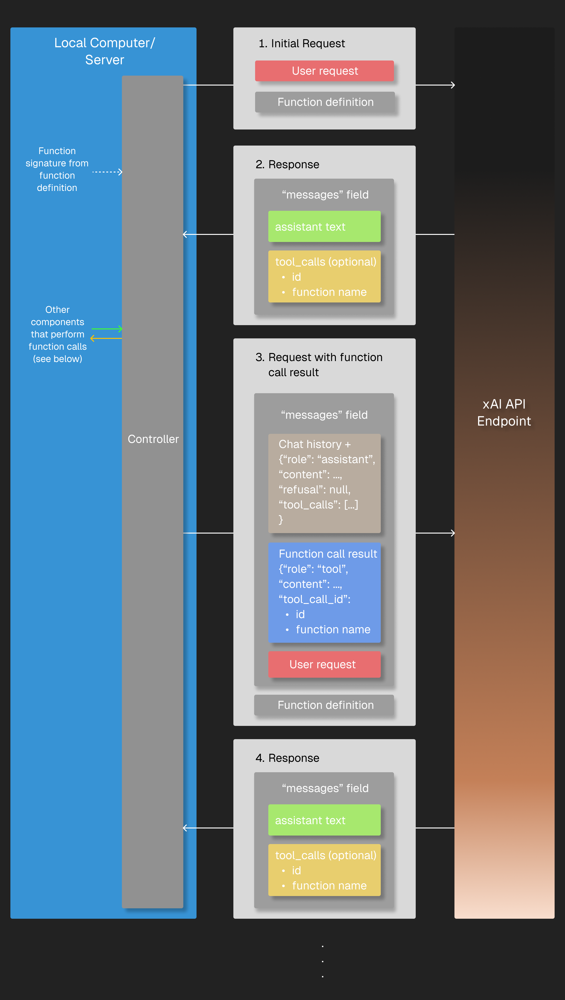

# 大模型 API 对比

OpenAI and Anthropic SDKs

## Grok - X

https://docs.x.ai/docs/api-reference

- chat(openai): /v1/chat/completions
- message(claud): /v1/messages
- completions(openai): /v1/completions
- complete: /v1/complete
- image: /v1/images/generations
- all modles: /v1/models
- get model: /v1/models/{model_id}
- chat models list: /v1/language-models 
- embedding: /v1/tokenize-text

## Function calling

